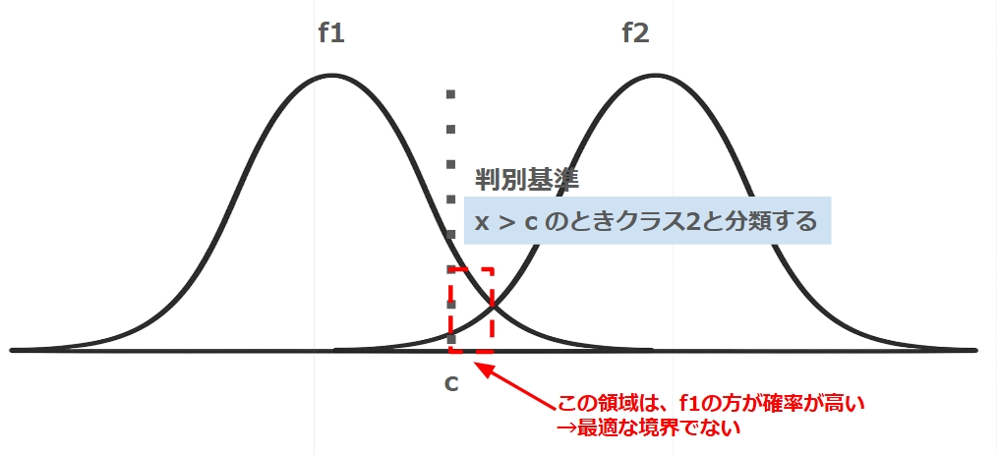

## [1]
$\bm{X}$ が $G_1$ に従うとき
$$
\begin{align*}
E[Y] &= E[X_1 + X_2]\\
&= 2\\
V[Y] &= V[X_1 + X_2]\\
&= V[X_1] + V[X_2] + 2Cov(X_1, X_2)\\
&= 3
\end{align*}
$$

$\bm{X}$ が $G_2$ に従うとき
$$
\begin{align*}
E[Y] &= E[X_1 + X_2]\\
&= -2\\
V[Y] &= V[X_1 + X_2]\\
&= V[X_1] + V[X_2] + 2Cov(X_1, X_2)\\
&= 3
\end{align*}
$$

## [2]
$$
R^{-1} = \frac{4}{3}\begin{pmatrix}1&-0.5\\-0.5&1\end{pmatrix}$$

$$
\begin{align*}
D_1^2 &= (\bm{x} - \bm{1})^T R^{-1}(\bm{x} - \bm{1})\\
&= \frac{4}{3}(x_1-1, x_2-1)\begin{pmatrix}1&-0.5\\-0.5&1\end{pmatrix}\left(\begin{array}{c}x_1-1\\x_2-1\end{array}\right)\\
&=(x_1-1)^2 - (x_1-1)(x_2-1) + (x_2-1)^2\\
&= x_1^2 -x_1 + x_2^2 - x_2 + - x_1x_2 + 1\\
\\
D_2^2 &= (x_1+1)^2 - (x_1+1)(x_2+1) + (x_2+1)^2\\
&= x_1^2 + x_1 + x_2^2 + x_2 -x_1x_2 + 1
\end{align*}
$$
$D_1^2 = D_2^2$ とすると

$$
\begin{align*}
&x_1^2 -x_1 + x_2^2 - x_2 + - x_1x_2 + 1 = x_1^2 + x_1 + x_2^2 + x_2 -x_1x_2 + 1\\
&\therefore x_1 = -x_2
\end{align*}
$$

## [3]
$Y$ を 平均$2$, 標準偏差$\sqrt{3}$ で標準化した 確率変数を$z_1$,平均$-2$, 標準偏差$\sqrt{3}$ で標準化した 確率変数を$z_2$ とする($z_1, z_2$ はどちらも標準正規分布に従う)

$$
\begin{align*}
&P(Y\lt0|G_1) = P\left(z_1 \lt \frac{-2}{\sqrt{3}}\right)\fallingdotseq 0.1251\\
\\
&P(Y\ge0|G_2) = P\left(z_2 \ge \frac{2}{\sqrt{3}}\right)\fallingdotseq 0.1251\\
\\
&Q = \frac{2}{3}P(Y\lt0|G_1)+\frac{1}{3}P(Y\gt0|G_2)\fallingdotseq 0.1251
\end{align*}
$$

## [4]
二つの確率密度関数 $f_1, f_2\quad (E[f_1]\lt E[f_2])$ について、誤判別率が最小となる $c$ では、$f_1(c) = f_2(c)$ となる ($\Rightarrow c$ が $f_1$ と $f_2$ の交点)   
(そうすると $c$ より大きい領域では、$f_1 \lt f_2$ すなわち $f_2$ から得られたサンプルの確率が高い)  

参考: $f_1(c) = f_2(c)$ からずらした場合
  

(確率五分五分のところを境界とするのが妥当)  

分布の事前確率を考慮すると
$$
\begin{align*}
\frac{2}{3}f_1(c) &= \frac{1}{3}f_2(c)\\
\\
2 &= \frac{f_2(c)}{f_1(c)}\\
 &= \frac{\frac{1}{\sqrt{2\pi\cdot 3}}\exp{\left(-\frac{(c+2)^2}{2\cdot 3}\right)}}{\frac{1}{\sqrt{2\pi\cdot 3}}\exp{\left(-\frac{(c-2)^2}{2\cdot 3}\right)}}\\
 &= \exp{\left(-\frac{8c}{6}\right)}\\
 \\
c &= -\frac{3}{4}\ln2\\
&\fallingdotseq-0.519
\end{align*}
$$
このときの誤判別率は、
$$
\begin{align*}
&P(Y\lt c|G_1) = P\left(z_1 \lt \frac{-0.519-2}{\sqrt{3}}\right)\fallingdotseq 0.0735\\
\\
&P(Y\ge c|G_2) = P\left(z_2 \ge \frac{-0.519+2}{\sqrt{3}}\right)\fallingdotseq 0.1949\\
\\
&Q = \frac{2}{3}P(Y\lt c|G_1)+\frac{1}{3}P(Y\gt c|G_2) \fallingdotseq 0.114
\end{align*}
$$