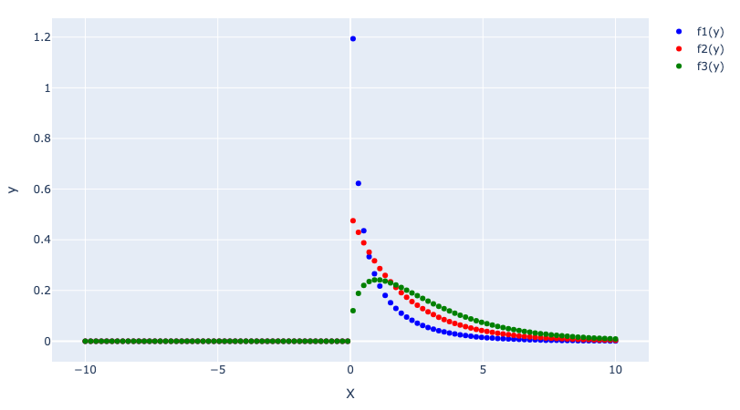

## [1]
$y\ge0$ の領域で、
$$
\begin{align*}
f_1(y) &= \frac{1}{2^{1/2}\Gamma(1/2)}y^{-1/2}e^{-y/2}\\
&= \frac{1}{\sqrt{2\pi}}y^{-1/2}e^{-y/2}\\
\\
f_2(y) &= \frac{1}{2\Gamma(1)}e^{-y/2}\\
&= \frac{1}{2}e^{-y/2}\\
\\
f_3(y) &= \frac{1}{2^{3/2}\Gamma(3/2)}y^{1/2}e^{-y/2}\\
&= \frac{1}{2^{3/2}\Gamma(1 + 1/2)}y^{1/2}e^{-y/2}\\
&= \frac{1}{2^{3/2}\frac{1}{2}\Gamma(1/2)}y^{1/2}e^{-y/2}\quad \because \Gamma(a+1) = a\Gamma(a)\\
&= \frac{1}{\sqrt{2\pi}}y^{1/2}e^{-y/2}\\
\end{align*}
$$

## [2]
$Y$, $Z$ が独立であることから、
$$
\begin{align*}
f(y, z) &= \frac{1}{\sqrt{2\pi}}y^{-1/2}e^{-y/2}\cdot\frac{1}{\sqrt{2\pi}}e^{-z^2/2}\\
&= \frac{1}{2\pi}y^{-1/2}e^{-1/2(y+z^2)}
\end{align*}
$$

$y\gt0$ の領域で、$x = z / \sqrt{y}$, $s = y$ とおく. 
$(-\infty \lt x \lt \infty, s\gt 0)$  
このとき、
$$
z = x\sqrt{s}\\
y = s
$$

ヤコビアン $J$ は、
$$
J = \begin{vmatrix}\frac{\partial z}{\partial x}& \frac{\partial z}{\partial s}\\
\frac{\partial y}{\partial x} & \frac{\partial y}{\partial s}\end{vmatrix} = \sqrt{s}
$$

$(Y, Z)\to(X, S)$ の変数変換を行うと、

$$
\begin{align*}
f(x, s) &= \frac{1}{2\pi}s^{-1/2}e^{-1/2(s+sx^2)}\cdot \sqrt{s}\\
&= \frac{1}{2\pi}e^{-1/2(1+x^2)s}
\end{align*}
$$

$S$ について積分すると
$$
\begin{align*}
g(x) &= \int_0^{\infty} f(x, s)ds\\
&= \int_0^{\infty} \frac{1}{2\pi}e^{-1/2(1+x^2)s} ds\\
&= \left[\frac{1}{2\pi}\cdot -\frac{2}{1+x^2} \cdot e^{-1/2(1+x^2)s}\right]_0^{\infty}\\
&= \frac{1}{\pi(1+x^2)}
\end{align*}
$$

## [3]

$$
x = \tan{w}\\
\frac{dx}{dw} = \frac{1}{\cos^2{w}}
$$

$$
\begin{align*}
h(w) &= \frac{1}{\pi(1+\tan^2{w})}\cdot \frac{1}{\cos^2{w}}\\
&=\frac{1}{\pi(\cos^2{w}+\sin^2{w})}\\
&= \frac{1}{\pi}
\end{align*}
$$

よって、Wは一様分布.

## [4]
$u' = \pi u - \pi/2$ で変換すると、U'は $(-\pi/2 \lt u' \lt \pi/2)$ の一様分布となる.   
次に $x = \tan {u'}$ とすれば良い
