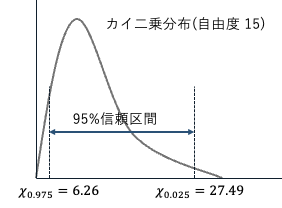

## [1]

$\mathbf{X}$ が独立に標準正規分布に従うとき、標本の二乗和は、カイ二乗分布に従う  

したがって、
$$
\sum_{i=1}^{16}\left(\frac{X_{B,i} - \bar{X}_B}{\sigma_B}\right)^2
$$
は、自由度15のカイ二乗分布に従い、 
この分布の95%信頼区間は、
$$
6.26 \le \sum_{i=1}^{16}\left(\frac{X_{B,i} - \bar{X}_B}{\sigma_B}\right)^2 \le 27.49
$$
  

問題文より、偏差平方和は

$$
T_B^2 = \sum_{i=1}^{16}(X_{B,i} - \bar{X}_B)^2 = 100
$$

なので、

$$
6.26 \le \frac{100}{\sigma_B^2} \le 27.49\\
100/27.49 \le \sigma_B^2 \le 100/6.26\\
3.64 \le \sigma_B^2 \le 15.97
$$

## [2]

